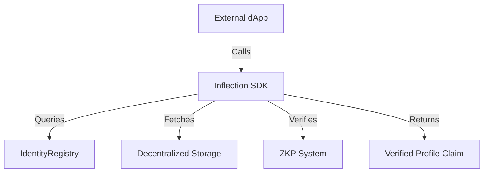

The Inflection SDK is a theoretical interface for external protocols (e.g., lending dApps) to verify DIDs, VCs, and ZKPs. It abstracts complex blockchain and cryptographic operations, enabling seamless integration with Inflection's identity layer while preserving user privacy.

## Theoretical Role

- **VC Verification**: Validates VCs against on-chain hashes and signatures.
- **ZKP Validation**: Verifies proof correctness without data exposure.
- **Multi-Chain Support**: Queries identities across compatible blockchains.

