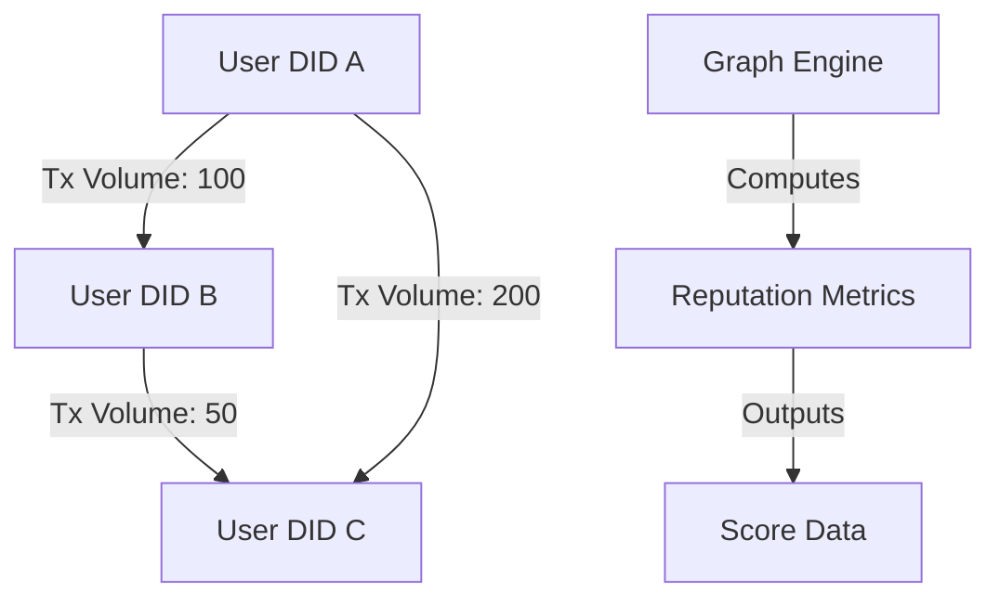

# Reputation Graph Engine

## Description

The Reputation Graph Engine models user interactions as a graph, where nodes represent DIDs or wallet addresses, and edges denote stablecoin transactions. It computes reputation metrics, such as transaction volume or frequency, to inform economic profiles. This component is theoretically designed to handle large-scale interaction data, supporting scalable reputation calculations.

## Theoretical Role

- **Graph Construction**: Builds a network of nodes (users) and edges (transactions).
- **Metric Computation**: Applies algorithms (e.g., weighted PageRank) to derive reputation scores.
- **Data Querying**: Provides queryable outputs for AI-driven profile generation.

## Diagram

The following Mermaid diagram visualizes the reputation graph. Render it in Mermaid Live Editor.

## Explanation

- **Graph Structure**: Nodes and edges represent user interactions.
- **Computation**: Metrics like volume drive reputation scores.
