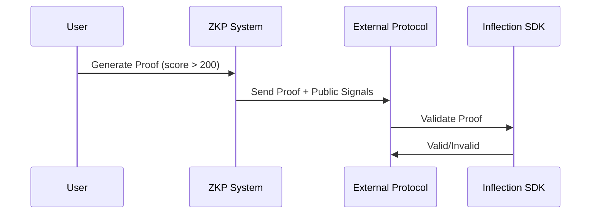

The Zero-Knowledge Proof (ZKP) System enables users to prove specific profile attributes (e.g., "reputation score > 200") without revealing the underlying data. Using cryptographic circuits and succinct proofs (e.g., SNARKs), it ensures privacy while maintaining verifiability across protocols.

## Theoretical Role

- **Circuit Design**: Defines proofs for attributes (e.g., inequality checks).
- **Proof Generation**: Computes proofs off-chain for efficiency.
- **Verification**: Supports on-chain or off-chain validation for interoperability.

## Diagram

The following Mermaid sequence diagram illustrates the ZKP flow. Render it in Mermaid Live Editor.

## Explanation

- **Privacy**: Proofs reveal only necessary claims.
- **Verification**: SDK validates proofs for trust.
